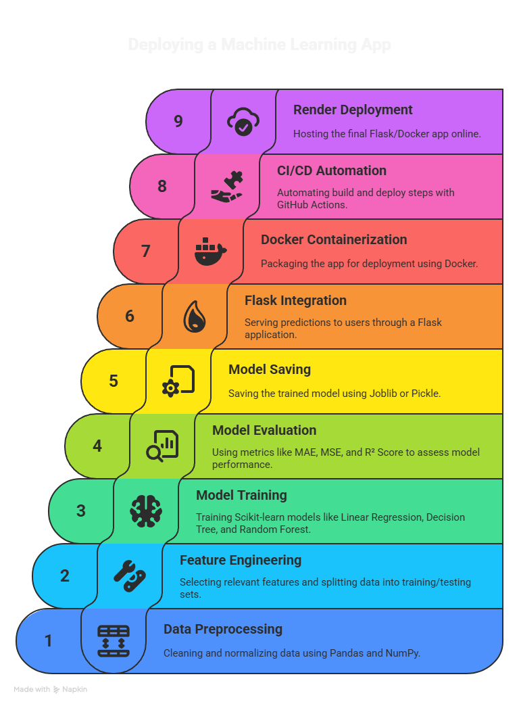
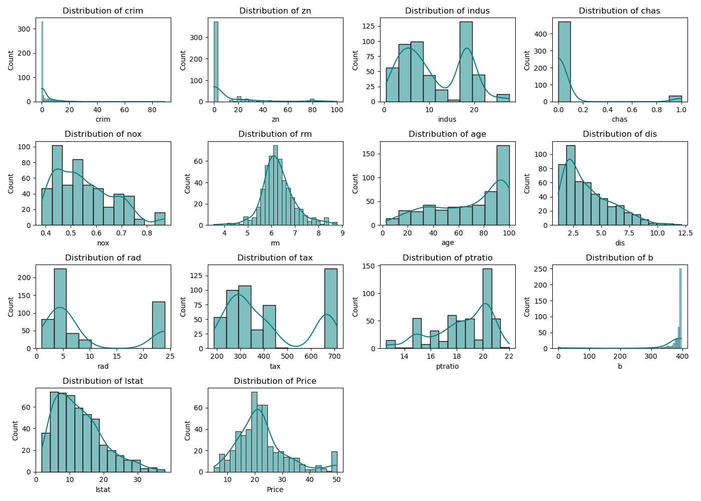
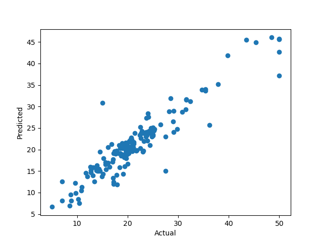

### boston-house price prediction

### Tools required

1. [render](https://render.com)
2. [Github Account](https://github.com)
3. [VSCodeIDE](https://code.visualstudio.com/)
4. [GitCLI](https://git-scm.com/book/en/v2/Getting-Started-The-Command-Line)


### Setup steps  
```bash
git clone https://github.com/pratp-123/boston-housprice.git
cd boston-housprice
python3 -m venv venv         # or use conda
source venv/bin/activate     # on Windows: venv\Scripts\activate
pip install -r requirements.txt
```

### libraries and tools



You’ll see whether features like RM (rooms per dwelling) or LSTAT (lower status population %) are normally distributed or skewed.


### Relationship Between Key Features and Target

✅ Insight:
RM increases with MEDV → more rooms, higher price
LSTAT decreases with MEDV → higher lower-status % = lower price


### scatter of predicted and actual data points


### Directory
```
Directory structure:
└── pratp-123-boston-housprice/
    ├── README.md
    ├── app.py
    ├── Dockerfile
    ├── LICENSE
    ├── Procfile
    ├── requirements.txt
    ├── scaling.pkl
    ├── templates/
    │   └── index.html
    └── .github/
        └── workflows/
            └── main.yaml
```

### 🎓 Key Learnings

Gained hands-on experience with the end-to-end Machine Learning workflow — starting from Exploratory Data Analysis (EDA) using pandas, matplotlib, and seaborn to understand dataset patterns, and analyze feature correlations.

Learned effective data preprocessing techniques including handling missing values, outlier treatment, and feature scaling using StandardScaler to prepare clean, normalized data for modeling.

Applied feature engineering by selecting important variables through correlation and feature importance analysis, and creating derived or polynomial features to capture complex relationships.

Implemented multiple regression algorithms such as Linear Regression, Decision Tree, Random Forest, and Gradient Boosting using scikit-learn, and improved their performance with k-fold cross-validation to ensure model generalization.

Performed hyperparameter tuning using GridSearchCV and RandomizedSearchCV to optimize model parameters and select the best-performing regressor.

Evaluated models using key metrics like R² Score, MAE, MSE, and RMSE, and visualized results through residual plots, predicted vs actual graphs, and feature importance charts for deeper interpretation.

Automated the entire process using GitHub Actions (CI/CD), enabling automatic testing, building, and deployment of the model through Dockerized pipelines.

Successfully deployed the Flask-based application on Render.com, integrating the Render API and Service ID for seamless continuous deployment.

Strengthened understanding of model lifecycle management, version control using Git & GitHub, and real-world deployment of ML models for production use.


